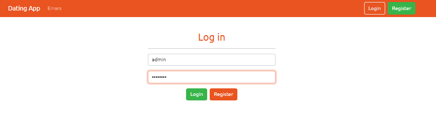

# TaskBoard – Real-time Collaborative Task Management

## Overview

TaskBoard là ứng dụng quản lý công việc theo dạng board (Kanban-style) hỗ trợ cập nhật thời gian thực bằng SignalR. Người dùng có thể đăng nhập, quản lý bảng công việc và nhìn thấy thay đổi được đồng bộ tức thời giữa nhiều client.

Dự án được xây dựng theo kiến trúc full-stack với:

* Frontend: Angular 15
* Backend: ASP.NET Core Web API (.NET 8)
* Database: SQL Server
* Realtime: SignalR
* Authentication: JWT
* Testing: xUnit + Moq

---

## Features

* User Authentication (Register / Login)
* JWT Authorization
* Create & manage boards
* Task management
* Realtime task synchronization
* SignalR board groups
* Unit testing with xUnit
* Repository pattern

---

# Screenshots

## 1. Login Screen

> Chụp màn hình đăng nhập và lưu vào:



Markdown:

```md

```

---

## 2. Board View

> Chụp màn hình board/task dashboard:

```text
/docs/screenshots/board-view.png
```

Markdown:

```md

```

---

## 3. Real-time Task Update Demo

Mở 2 tab browser → cập nhật task ở tab A → tab B tự đổi.

Lưu ảnh:

```text
/docs/screenshots/realtime-demo.png
```

Markdown:

```md

```

---

# Tech Stack

## Frontend

* Angular 15
* TypeScript
* RxJS
* Bootstrap
* Toastr
* SignalR Client

## Backend

* ASP.NET Core Web API (.NET 8)
* Entity Framework Core
* SQL Server
* JWT Authentication
* SignalR
* Repository Pattern

## Testing

* xUnit
* Moq

## Development Tools

* Visual Studio Code
* Visual Studio
* SQL Server Management Studio
* Postman
* Git

---

# Project Structure

```text
TaskBoard/
│
├── API/
│   ├── Controllers/
│   ├── Data/
│   ├── DTOs/
│   ├── Entities/
│   ├── SignalR/
│   └── Program.cs
│
├── client/
│   ├── src/
│   ├── app/
│   └── environments/
│
├── TaskBoard.Tests/
│
└── README.md
```

---

# Run Locally

## 1. Clone project

```bash
git clone <your-repository-url>
cd Building-Dating-App-web-design
```

---

## 2. Backend Setup

Đi vào thư mục API:

```bash
cd API
```

Khôi phục package:

```bash
dotnet restore
```

Apply migration:

```bash
dotnet ef database update
```

Chạy backend:

```bash
dotnet run
```

API mặc định:

```text
https://localhost:5001
```

hoặc:

```text
http://localhost:5000
```

---

## 3. Frontend Setup

Di chuyển:

```bash
cd client
```

Cài package:

```bash
npm install
```

Chạy Angular:

```bash
ng serve
```

Mở:

```text
http://localhost:4200
```

---

# SignalR Realtime Demo

Để kiểm tra realtime:

### Bước 1

Đăng nhập tài khoản ở tab trình duyệt thứ nhất.

### Bước 2

Mở tab thứ hai.

### Bước 3

Đăng nhập cùng board.

### Bước 4

Thay đổi task ở tab đầu.

Kết quả:

* TaskUpdated event được phát
* SignalR gửi theo board group
* Tab còn lại tự động cập nhật

Không cần refresh trang.

---

# Unit Tests

Chạy test:

```bash
cd TaskBoard.Tests
dotnet test
```

Kết quả mong đợi:

```text
Passed: 6
Failed: 0
```

Bao gồm:

* SignalR broadcast tests
* Group management tests
* Connection lifecycle tests

---

# Future Improvements

* Drag & Drop task cards
* User avatar
* Notifications
* File attachments
* Docker deployment
* CI/CD pipeline

---

# Author

Hoàng Xuân Tiến

Full Stack Developer / Data Enthusiast
